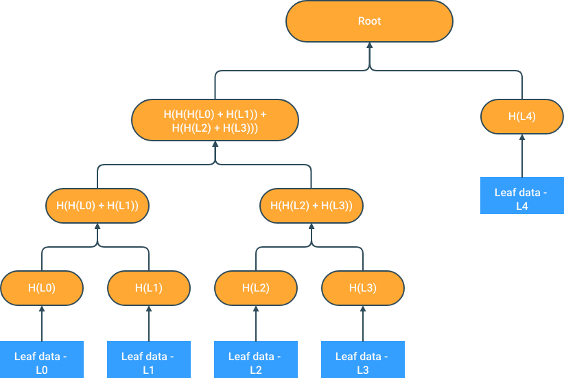

# Merkle Tree

Implement a [Merkle tree](https://en.wikipedia.org/wiki/Merkle_tree) and functions to verify proofs using it.

- Pick any popular [cryptographic hash function](https://en.wikipedia.org/wiki/Cryptographic_hash_function) library, such as BLAKE2 or Keccak. You don’t need to implement the hash function.
- Supports arbitrary number of leaves. They are initially hashed using the same hash function as the inner nodes. Inner nodes are created by concatenating child hashes and hashing again. The implementation does not need to perform any sorting of the input data (leaves).
- If the number of leaves is not even, the last leaf is promoted to the upper layer. So a 5-leaf Merkle tree look like this:

    

- Supports the following calls:
    - `fn merkle_root(leaves: Iterator) -> Hash`

        This function constructs a root hash of a Binary Merkle Tree created from given leaves

    - `fn merkle_proof(leaves: Iterator, leaf_index: usize) -> MerkleProof`

        This function constructs a Merkle Proof for leaf specified by the index, by first constructing a (partial) Merkle Tree and return a `struct` storing all elements required to prove the leaf item, and contains the following:

        ```rust
        struct MerkleProof<T> {
          pub hashes: Vec<Hash>,
          pub num_of_leaves: usize,
          pub leaf_index: usize,
          pub leaf_content: T
        }
        ```

    - `fn verify_proof(root: &Hash, proof: &MerkleProof) -> bool`

        This function verifies if the provided MerkleProof struct can finally generate back the Merkle `root` and prove itself.


## Usage Examples

```rust
let data = vec![b"abc", b"bcd", b"cde", b"def", b"efg"];
let root = MerkleTree.merkle_root(&data);
let proof = MerkleTree.merkle_proof(&data, 1);
assert_eq!(MerkleTree.verify_proof(&root, &proof), true);
```

## References

- [https://en.wikipedia.org/wiki/Merkle_tree](https://en.wikipedia.org/wiki/Merkle_tree)
- [https://ethereum.org/en/developers/tutorials/merkle-proofs-for-offline-data-integrity/](https://ethereum.org/en/developers/tutorials/merkle-proofs-for-offline-data-integrity/)
